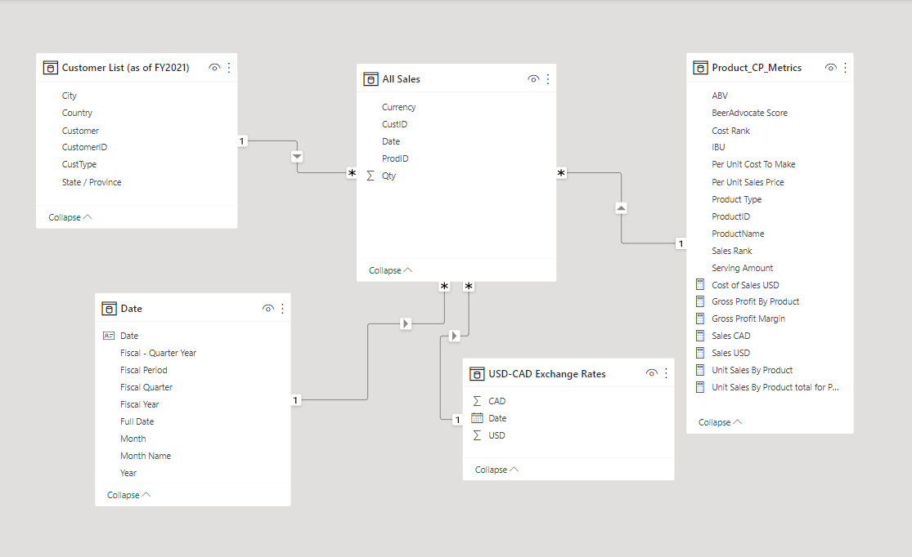

### Create a Data Model for Seven Sages Brewing Company ###

Objective:

The main objective is to clean and model the dataset for a small brewing company to help them understand their sales and profits. The CFO specifically wants to know what the sales, cost of sales, and gross profit margin are in two different currencies.

This project demonstrates data modeling principles, including the ability to clean, organize, and structure data using Power Business Intelligence. This project uses Power BI to extract the data, Power Query Editor to clean and transform, and finally Power BI to model and create a report.

Extracting the Data:

* CFO's Metrics Tracker - The CFO's metrics documentation that he has been compiling on sales, costs, and servings (per item for sale).
* Customer List (as of FY2021) - Customer records.
* SSBC Product Offerings - This is a list of all the company's current offerings, ratings, and serving sizes.
* USD-CAD Exchange Rates - This is a file containing the currency exchange rates.
* Monthly Sales Logs - Data on purchases.
* All files are found under "Seven_Sages_Data".

Transforming the Data:

* Merged 12 monthly sales files into one for better query performance.
* Promoted first rows to headers as needed.
* Reviewed data types for each field to ensure that they are identified correctly.
* Renamed ambiguous queries so they can be easily identified during data modeling.
* Renamed columns with descriptive names.
* Removed NULL and blank rows.

Data Modeling:

* Created a data model based on the star schema data model.
* Dimension tables have a 1-to-many cardinality pointing to the fact table (Sales).
* Created a Data table to match Seven Sages Fiscal Year, beginning October 1st and running until September 30th. A transaction on September 20th, 2020 would fall in FY 2020, but a transaction on October 20th would land in FY 2021.

Writing DAX Measures:

* Sales in USD ($)
* Cost of Sales USD ($)
* Gross Profit Margin (GPM) in USD ($)
* Sales in CAD ($)
* Unit Sales By Product (%)
* Share of gross profit by product type (%)

Building a visual report:

This report has two tabs, one summarizes sales by customer and customer type across quarters. The second summarizes the percentages of gross profit and unit sales by product.

